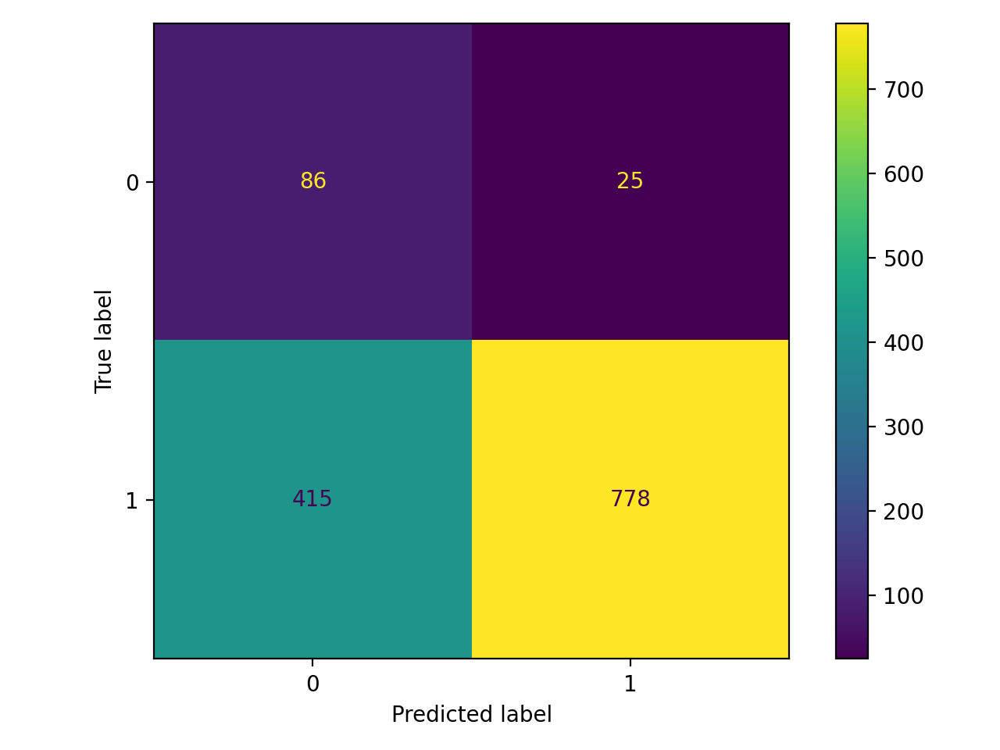
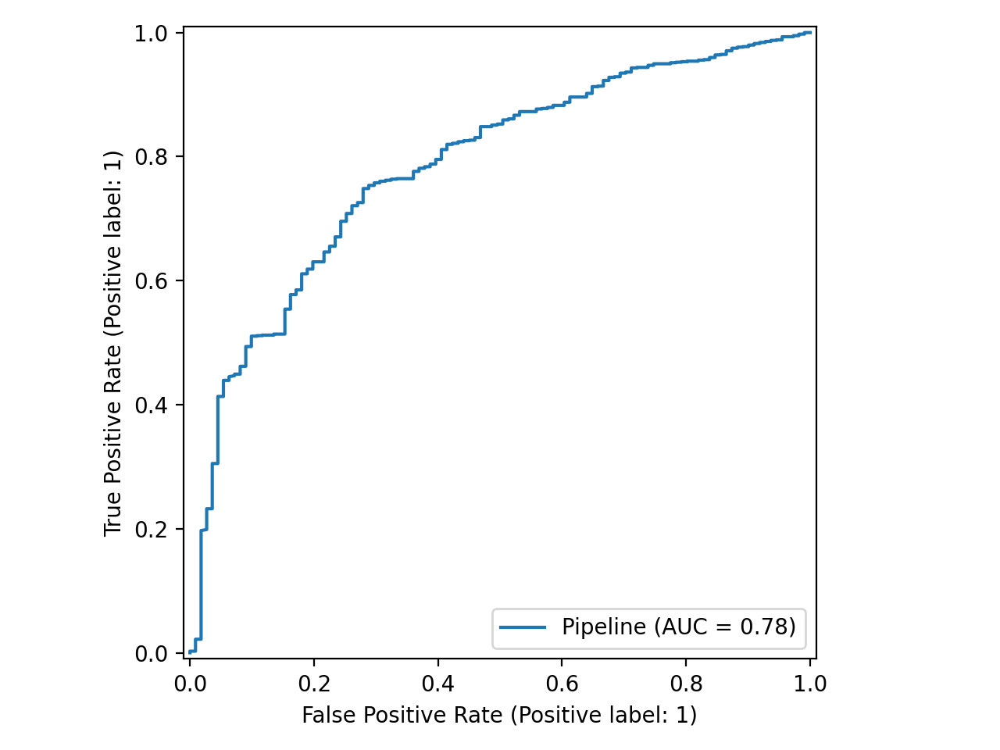

# Credit Risk Prediction using Canadian Financial Capability Survey (CFCS 2014)

## Overview

This project builds a machine learning pipeline to predict whether an individual is likely to miss loan or bill payments using demographic and financial features from the Canadian Financial Capability Survey (CFCS 2014).

The goal is to demonstrate an end-to-end data science workflow including preprocessing, modeling, and evaluation.

---

## Dataset

- Source: Statistics Canada – Canadian Financial Capability Survey (2014)
- File: `data/cfcs_2014.csv`
- Target variable: `LATEPMTP`

Mapping:
- 1 = Had late payments  
- 2 = Did not have late payments  

A data dictionary is provided in `docs/CFCS2014ENcbk.pdf`.

---

## Project Structure

```
credit-risk-prediction/
├── data/
│   ├── cfcs_2014.csv
│   └── processed/
├── docs/
├── notebooks/
│   └── eda.ipynb
├── src/
│   ├── preprocess.py
│   ├── train_model.py
│   └── evaluate.py
├── models/
├── results/
├── requirements.txt
└── README.md
```

---

## Methodology

- Exploratory Data Analysis (EDA) in Jupyter Notebook
- Feature selection and cleaning
- Missing value imputation
- One-hot encoding for categorical variables
- Logistic Regression with class balancing
- Train-test split with stratification
- Model evaluation using Accuracy, ROC-AUC, and Confusion Matrix

---

## Results

The Logistic Regression model achieves meaningful separation between high-risk and low-risk individuals, evaluated using ROC-AUC and confusion matrix analysis.

ROC-AUC on the test set: 0.784.

### Confusion Matrix


### ROC Curve


---

## How to Run

From the project root directory:

```bash
pip install -r requirements.txt
python src/preprocess.py
python src/train_model.py
python src/evaluate.py
```

---

## Technologies

- Python
- pandas
- NumPy
- scikit-learn
- matplotlib
- Jupyter

---

## Author

Anna Cherkashina  
BSc Data Science, Simon Fraser University

